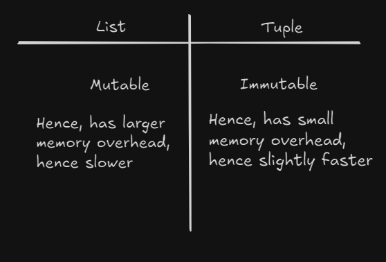
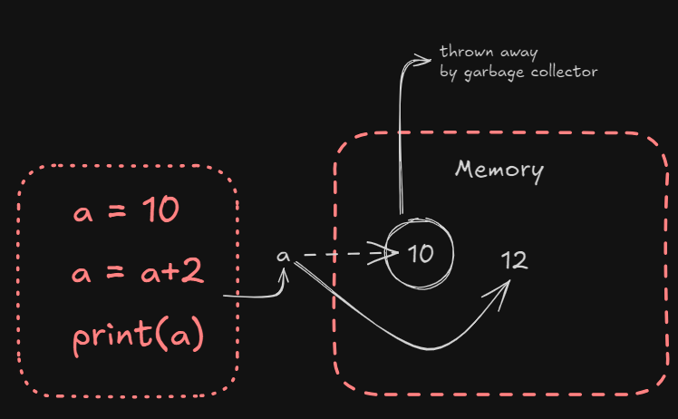

# Object types/ Data types

- Number: 1234, 3.14, 3+4i, 0b111, Decimal(), Fraction()
- String: 'spam', "still works", b'a\x01c', u'sp\xc4m'
- List: [1,[2,'three'], 4.5], list(range(10))
- Tuple: (1,'spam', 4, 'U')
- Dictionary: {'food':'spam', 'taste':'yum'}, dict(hours =10)
- Set: set('abc'), {'a', 'b', 'c'}

-File: open('test.txt')

- Boolean: True, False
- None: None
- Functions, modules, classes, 

-Advance: Decorators, Generators, Iterators, MetaProgramming

## Difference between Tuple and List


- Note: Suppose we have a = 3, "a" doesn't have any data type, the "3" which is stored in memory has a datatype, and the reference of this "3" is inside the variable "a"

## Example 1:
```py
a = 10
a = a+2
print(a) #OUTPUT: 12
```


## Example 2:
```py
n = [1,2,3]
m = n
# Now, both n and m are pointing at the same memory location
#Therefore:
m == n  # TRUE
m is n # TRUE

#But if we define n again now,
n = [1,2,3]
m == n # TRUE
m is n # FALSE!!!!
```

Here, m is n returns false because they **Don't point at the same memory reference!!**