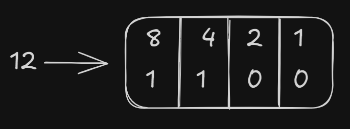

# BitWise Operators
**All bitwise operators are:**
- Complement (~)
- And (&)
- Or (|)
- XOR (^)
- Left Shift (<<)
- Right Shift (>>)

## Complement (~)
Suppose we run the following code snippet
```py
~12 #OUTPUT: -13 
```
Why -13 though :thinking: Lets look into this in the binary system.



So, 12 can be written as 1100 in binary system.
But, only positive numbers are stored right, so -13 needs to be converted into a positive number, for this, we use 2's Complement.

```math
2' = 1' + 1
```
So, Binary of +13 is ```1101```
So, 1' is ```0010```
Therefore, 2' is ```0010 + 1``` =>  ```0011 ```

And here, we see ```0011``` is complement of ```1100```, Hence, ```~12 = -13```!!
 
Though, from observation, ``` ~a = -(a+1) ``` is a general formula.

## And ( & )
```python
12&13 #OUTPUT: 12
```
12: 1100
13: 1101
Therefore, 12&13: 1100 ==> 12!!

## OR ( | )
```python
12|13 #OUTPUT: 13
```

12: 1100
13: 1101
12 or 13: 1101 ==> 13!

## XOR ( ^ )
12: 1100
13: 1101
12 XOR 13: 0001 ==> 1!!
Therefore,
```python
12^13 #OUTPUT: 1
```

## Left shift (<<)
10 : 1010
So, in **left** shift (10 << 2), we effectively shift the decimal point to the **right** by 2 places

So, 
```
1010.000 ==> 101000.000 ( this number is 32+8 = 40)
```

So, 
```python
10 << 4 #OUTPUT: 40!
```
Similarly we can understand how right shift works!